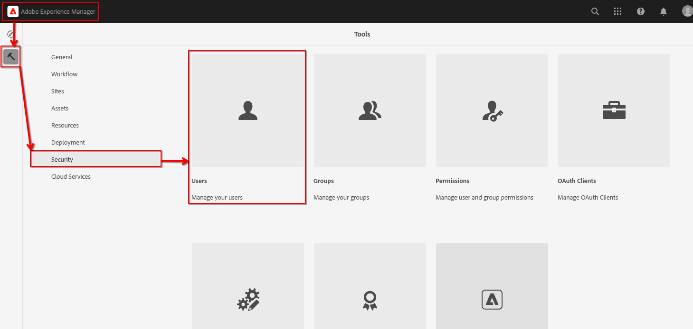
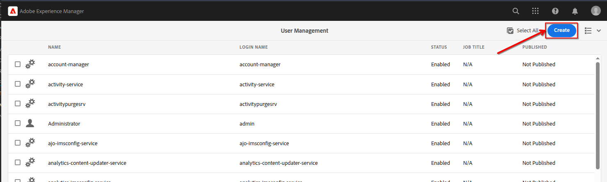
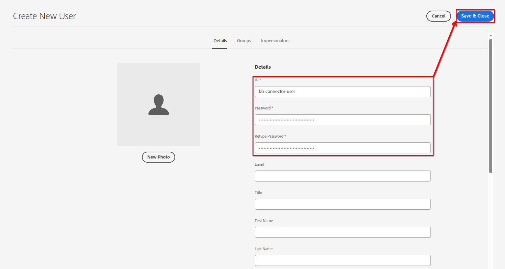
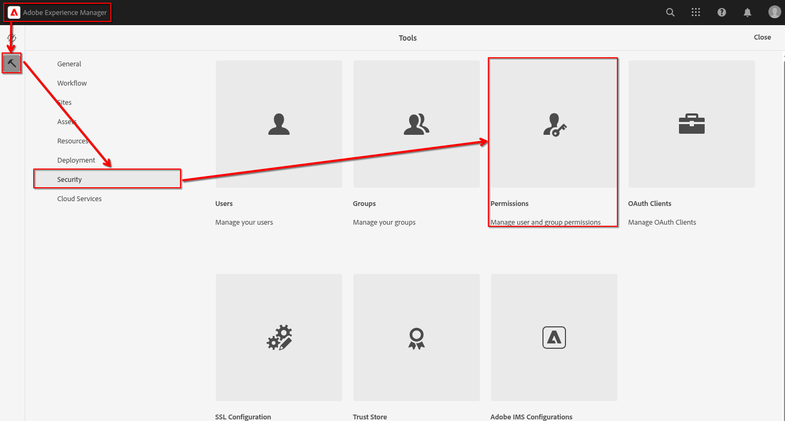
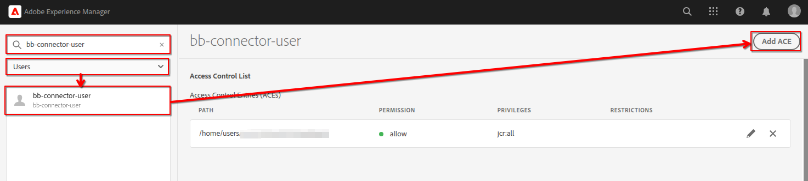
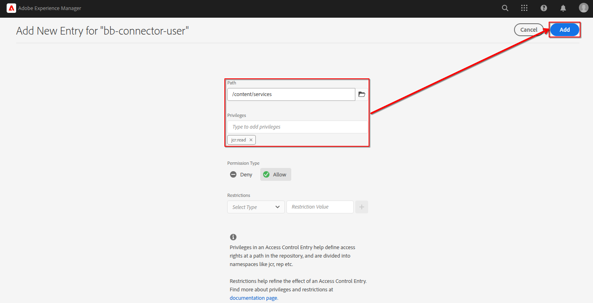

# Blackbird AEM Connector

## Blackbird AEM Connector –  OpenAPI 3.0
The YAML specification [included in the documentation](https://github.com/bb-io/AEM/blob/main/docs/openapi/BlackBird%20AEM%20connector.yaml) follows the OpenApi 3.0 standard and is designed to be compatible with Swagger UI and other OpenAPI tools.

You can paste this YAML directly into tools like [Swagger Editor](https://editor-next.swagger.io/) or integrate it into an internal API portal for interactive exploration

## Prerequisites
> These steps are optional and should only be performed if the Blackbird AEM Connector needs to be installed as part of the deployment process.

[Go to Configure Basic Authorization](#configure-basic-authorization) if you don't need these steps.

Even though this repository is **public**, GitHub **requires authentication** to download packages from **GitHub Packages**, including for **Maven dependencies**. This is a security feature to prevent anonymous abuse of GitHub's infrastructure.

Follow these steps to generate a token and configure Maven to use it:

### Step 1: Create a GitHub Personal Access Token (PAT)

#### 1.1 Open the Token Generator

[Generate a new token (classic) with the `read:packages` scope](https://github.com/settings/tokens/new?scopes=read:packages)

#### 1.2 Configure the Token

- **Note**: `Maven Access Token`
- **Expiration**: Choose `30 days`, `90 days`, or `No expiration`
- **Scope**:
    - `read:packages` (only this is needed)

> This token will **only allow read access to published packages**, and cannot modify repositories or access private code.

#### 1.3 Click "Generate Token"

Copy the token **immediately** — you won’t be able to see it again.

### Step 2: Configure Maven to Use the Token

#### 2.1 Add to settings.xml
Create a file in your .m2 repository called `settings.xml` (or modify the current one). The path for this file should be `~/.m2/settings.xml`:
Add the following block:

```xml
<settings xmlns="http://maven.apache.org/SETTINGS/1.0.0">
  <servers>
    <server>
      <id>bb-io-AEM-github</id>
      <username>GITHUB_USERNAME</username>
      <password>PASTE_YOUR_PAT_HERE</password>
    </server>
  </servers>
</settings>
```
#### 2.2 Replace:
- `GITHUB_USERNAME` with your GitHub username
- `PASTE_YOUR_PAT_HERE` with the token you just generated

### Step 3: Add the Repository in your root pom.xml
```xml
<repositories>
    <repository>
        <id>bb-io-AEM-github</id>
        <url>https://maven.pkg.github.com/bb-io/AEM</url>
        <releases>
            <enabled>true</enabled>
        </releases>
        <snapshots>
            <enabled>true</enabled>
        </snapshots>
    </repository>
</repositories>
```
### Step 4: Add the Dependency in your root pom.xml
#### 4.1 Update pom.xml with
```xml
<dependency>
  <groupId>aem-on-prem.io.blackbird</groupId>
  <artifactId>bb-aem-connector.all</artifactId>
  <type>zip</type>
  <version>{current_version}</version>
</dependency>
```
#### 4.2 Replace placeholder {current_version} with the latest version.

### Step 5: Add the Dependency in your /all/pom.xml
```xml
<dependency>
  <groupId>aem-on-prem.io.blackbird</groupId>
    <artifactId>bb-aem-connector.all</artifactId>
    <type>zip</type>
</dependency>
```
### Step 6: Add the package as an embedded dependency to your /all/pom.xml
```xml
<embedded>
  <groupId>aem-on-prem.io.blackbird</groupId>
  <artifactId>bb-aem-connector.all</artifactId>
  <type>zip</type>
  <target>/apps/bb-vendor-packages/application/install</target>
</embedded>
```
> NOTE: Add path `/apps/bb-vendor-packages/application/install` to `filter.xml` for `all` module or change target path for the embed.

### Step 7: Commit all the changes to the branch and push the changes

### Step 8: The build for AEM on-prem can now be done

## Configure Basic Authorization
If you don’t embed the connector dependency into your project, please first download and install the latest version of the connector using [the link](https://github.com/bb-io/AEM/packages/2548678) before proceeding with the steps below.
### Steps to create separate a user with required permissions
1. Use `Adobe Experience Manager` to navigate to `Tools` -> `Security` -> `Users`. 
2. Click `Create`.  
3. Fill in `ID`, `Password`, `Retype password` fields and click `Save & Close`. 
4. Use `Adobe Experience Manager` to navigate to `Tools` -> `Security` -> `Permissions`. 
5. Enter the user ID from step 3 in the search field.
   1. Select `Users` from then dropdown.
   2. Click on the username in the search results.
   3. Click `Add ACE`. 
6. Fill in the `Path` with `/content/services`, `Privileges` with `jcr:read` and click `Add`. 

### Validate integration
To validate the integration, you can run the following `curl` command:
```shell
curl -u {username_from_step_3}:{user_password_from_step_3} -H "Accept: application/json" https://{aem_host}:{aem_port}/content/services/bb-aem-connector/content.json?contentPath=/content
```
In response, you should get something like this:
```json
{"values":[{"name":"wknd","path":"/content/wknd","properties":[{"name":"jcr:primaryType","value":"cq:Page","multiValue":false}]}]}
```